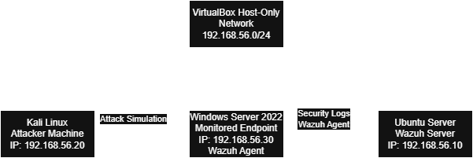

# SOC Cybersecurity Home Lab

This repository documents the construction of a personal Security Operations Center (SOC) laboratory used for cybersecurity training, attack simulation and detection analysis.

The goal of this project is to simulate real-world cyber attacks and analyze how a SOC environment detects and responds to them.

---

## Lab Architecture

The lab environment is built using virtualization.

Platform:
Oracle VirtualBox

Virtual Machines:

Kali Linux  
Role: Attacker machine

Ubuntu Server  
Role: Wazuh SIEM server

Windows Server 2022  
Role: Monitored endpoint

---

## Network Topology

VirtualBox Host-Only Network

Network range:

192.168.56.0/24

Example addresses:

Wazuh Server  
192.168.56.10

Kali Linux  
192.168.56.20

Windows Server  
192.168.56.30

---

## Lab Topology Diagram

The diagram above represents the architecture of the SOC home lab environment. 
The Kali Linux machine simulates attacks against the Windows Server endpoint, 
while the Ubuntu server runs Wazuh to collect and analyze security logs generated by the system.  

---

## Technologies Used

Kali Linux  
Ubuntu Server  
Windows Server 2022  
Wazuh SIEM  
VirtualBox

---

## Project Structure

docs/
Laboratory documentation and setup phases

attacks/
Simulated cyber attacks executed from the attacker machine

detections/
Detection rules and security monitoring use cases

scripts/
Automation scripts used in the lab

---

## Project Phases

Phase 1 – Virtual machine setup  
Phase 2 - Network Configuration  
Phase 3 – Wazuh installation  
Phase 4 – Wazuh agent installation  
Phase 5 - Sysmon instalation  
Phase 6 – Attack simulation  
Phase 7 – Detection and log analysis  

---

## Purpose

This project is part of my cybersecurity training focused on:

Security Operations Center (SOC)  
Threat detection  
Log analysis  
Incident investigation
