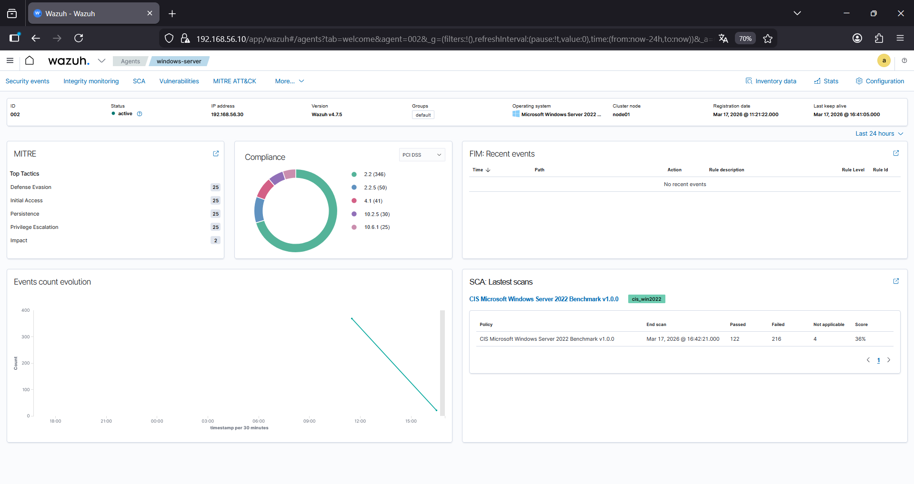
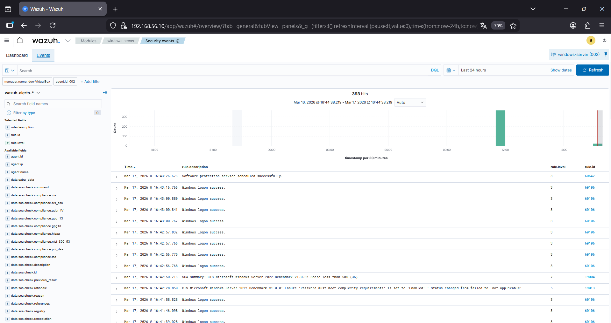

# Phase 4 – Wazuh Agent Installation (Windows Server)

This phase covers the installation and configuration of the Wazuh agent on a Windows Server machine, enabling centralized log collection and monitoring.

## Objective

Integrate a Windows endpoint into the Wazuh SIEM to collect security events and validate monitoring capabilities.

## Environment

Monitored machine:

Windows Server 2022  
Role: Endpoint (Agent)  
IP: 192.168.56.X  

Wazuh Server:

Ubuntu Server  
IP: 192.168.56.10  

## Agent Installation

### Step 1 – Download Wazuh Agent

The agent was downloaded from the official Wazuh website.

### Step 2 – Install Agent

The installer was executed on the Windows Server machine.

### Step 3 – Configure Wazuh Server ارتباط

During installation, the following information was provided:

Wazuh Server IP: 192.168.56.10  

### Step 4 – Start Service

The Wazuh agent service was started after installation.

## Agent Registration

The agent was registered and validated on the Wazuh server.

## Verification

After installation, the agent appeared in the Wazuh dashboard.

Logs from the Windows machine started being collected and indexed.

## Events Observed

Examples of monitored events:

- Login activity  
- System events  
- Security logs  

## Status

Agent successfully connected and actively sending logs to Wazuh server.

## Agent Connected

The image below shows the Windows agent successfully connected:

## Events Monitoring

Below are examples of events collected from the Windows endpoint:

