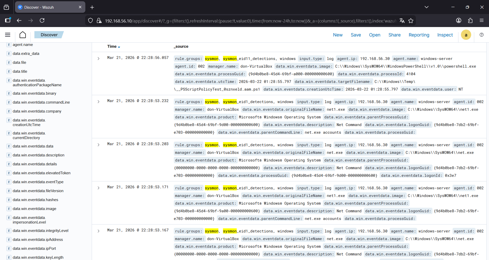

# Phase 5 – Sysmon Installation and Configuration

This phase focuses on enhancing endpoint visibility by installing Sysmon on the Windows Server machine.

## Objective

Improve logging capabilities by capturing detailed system activity such as process creation, network connections and file modifications.

## Environment

Windows Server 2022  
Role: Monitored endpoint  
IP: 192.168.56.30  

Wazuh Server:  
192.168.56.10  

## What is Sysmon

Sysmon (System Monitor) is a Windows system service that logs detailed system activity into the Windows Event Log.

These logs are later collected by Wazuh for analysis.

## Installation

### Step 1 – Download Sysmon

Sysmon was downloaded from the official Microsoft Sysinternals suite.

### Step 2 – Install Sysmon

Example command used:
sysmon64.exe -i

## Configuration

A Sysmon configuration file was used to define which events should be monitored.

Examples of monitored events:

- Process creation  
- Network connections  
- File creation  
- Registry changes  

## Integration with Wazuh

Sysmon logs are written to:

Microsoft-Windows-Sysmon/Operational

Wazuh collects these logs through the Windows agent.

## Verification

After installation, Sysmon events were visible in the Wazuh dashboard.

Example:

Sysmon - Process Create  
Sysmon - Network Connection  

## Sysmon Events in Wazuh

The image below shows Sysmon-generated events being collected and analyzed by Wazuh:

## Security Value

Sysmon significantly improves visibility by providing detailed telemetry that is not available in default Windows logs.

This allows better detection of suspicious behavior during attack simulations.

## Status

Sysmon successfully installed and generating logs, which are being collected by Wazuh.
